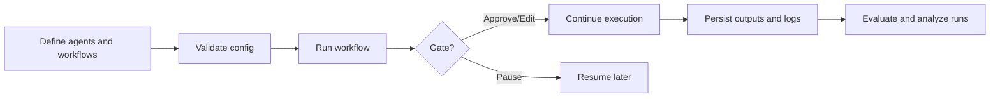
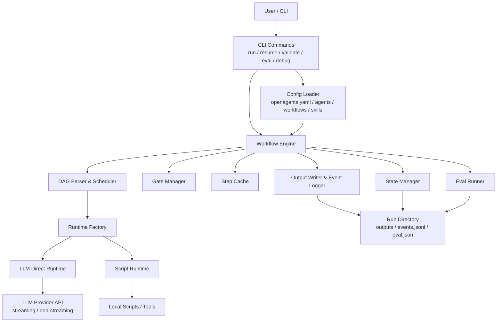

# OpenAgents

Transparent, controllable multi-agent workflow orchestration for the terminal.

[中文文档](./README.zh-CN.md)

## Why OpenAgents

OpenAgents is built for workflows where "just run the agents" is not enough.
You can inspect progress in real time, pause at critical gates, resume interrupted runs, evaluate outcomes, and keep every step traceable on disk.

### Core Principles

- **Visible**: execution progress is shown step by step.
- **Controllable**: critical steps can be reviewed, approved, edited, or resumed.
- **Traceable**: outputs, logs, run state, and evaluation results are persisted locally.

## Highlights

### Workflow Execution

- DAG-based multi-agent orchestration with parallel scheduling
- Human-in-the-loop gates with `yes` / `no` / `edit`
- Gate automation via `--auto-approve` and `--gate-timeout`
- Resume interrupted runs from persisted state
- Streaming and non-streaming LLM execution
- LLM function calling with multi-round tool execution
- Script runtime for local preprocessing or custom execution
- Step-level post-processors for output cleanup and transformation
- Step and workflow cache for repeatable runs
- Error recovery modes: `fail`, `skip`, `fallback`, `notify`

### Prompting and Context

- Plain text input plus structured input with `--input-json` and `--input-file`
- Template variables such as `{{input}}`, `{{inputs.xxx}}`, `{{context.stepId}}`
- Context strategies: `raw`, `truncate`, `summarize`, `auto`
- Skills registry for reusable instructions

### Developer Experience

- Terminal progress UI built with `ora`, `chalk`, and `boxen`
- Config validation with schema and advanced checks
- Template preview via `openagents debug template`
- DAG visualization via `openagents dag`
- Debug HTTP server via `openagents debug server`
- Run inspection commands for status, logs, and evaluation history
- Built-in workflow evaluation and trend analysis

### Provider Compatibility

- OpenAI-compatible `llm-direct` runtime
- Automatic fallback for providers that return reasoning output in `reasoning_content`
- Automatic adaptation when a "streaming" request returns normal JSON instead of SSE

## Quick Start

### 1. Install

```bash
npm install
npm run build
```

### 2. Run from source

```bash
npx tsx src/cli/index.ts run novel_writing --input "A time-travel mystery"
```

### 3. Or initialize a starter project

```bash
npx tsx src/cli/index.ts init my-project
cd my-project
export OPENAGENTS_API_KEY=sk-xxxx
npx tsx src/cli/index.ts run novel_writing --input "A time-travel mystery"
```

## Starter Templates

OpenAgents currently ships with these `init` templates:

| Template | Purpose |
| --- | --- |
| `default` | General-purpose starter project |
| `chatbot` | Conversational agent workflow |
| `web-scraper` | Extract and summarize web content |

List available templates:

```bash
openagents init --list-templates
```

Use a specific template:

```bash
openagents init my-project --template chatbot
```

## Common Commands

### Project Setup and Validation

```bash
openagents init [directory]
openagents init [directory] --template <name>
openagents init --list-templates
openagents validate
openagents validate --verbose
```

### Running Workflows

```bash
openagents run <workflow_id> --input "..."
openagents run <workflow_id> --input-json '{"topic":"climate"}'
openagents run <workflow_id> --input-file ./input.json
openagents run <workflow_id> --stream
openagents run <workflow_id> --auto-approve
openagents run <workflow_id> --gate-timeout 30
openagents run <workflow_id> --no-eval
openagents resume <run_id>
openagents resume <run_id> --stream
```

### Inspecting Runs

```bash
openagents runs list
openagents runs list --workflow <workflow_id>
openagents runs list --eval
openagents runs show <run_id>
openagents runs logs <run_id>
openagents eval <run_id>
openagents analyze <workflow_id>
```

### Exploring the Project

```bash
openagents agents list
openagents agents list --skills
openagents workflows list
openagents dag <workflow_id>
openagents debug template <workflow_id> --input-json '{"key":"value"}'
openagents debug server
openagents cache stats
openagents cache clear
```

## Typical Workflow



## Architecture



In practice, the CLI loads project config, the workflow engine builds an execution plan, runtimes execute each step, and all outputs, logs, and evaluation artifacts are persisted into the run directory for replay and inspection.

## Example Workflow Features

### Structured Input

```yaml
steps:
  - id: plan
    agent: planner
    task: "Create a plan for {{inputs.topic}} in {{inputs.language}}."
```

Run it with:

```bash
openagents run report --input-json '{"topic":"AI safety","language":"English"}'
```

### Context Processing

```yaml
steps:
  - id: research
    agent: researcher
    task: "Gather background information"

  - id: write
    agent: writer
    depends_on: [research]
    context:
      from: research
      strategy: auto
      max_tokens: 1000
      inject_as: system
    task: "Write using: {{context.research}}"
```

### Error Recovery

```yaml
steps:
  - id: summarize
    agent: writer
    on_failure: fallback
    fallback_agent: backup_writer
    task: "Summarize the research"
```

Supported `on_failure` modes:

- `fail`: stop the workflow
- `skip`: skip this step and continue downstream when possible
- `fallback`: retry with `fallback_agent`
- `notify`: send `notify.webhook` and fail

### Step Post-Processors

```yaml
steps:
  - id: load_context
    agent: planner
    task: "Generate a long context"
    post_processors:
      - type: script
        name: shrink_context
        command: node scripts/shrink-context.mjs
        timeout_ms: 5000
        max_output_chars: 20000
        on_error: fail
```

Script processor contract:

- Input is provided through `stdin`
- Output is read from `stdout`
- Logs should go to `stderr`
- Exit code `0` means success
- Available env vars: `OA_RUN_ID`, `OA_WORKFLOW_ID`, `OA_STEP_ID`, `OA_PROCESSOR_NAME`

## Evaluation and Analysis

OpenAgents can evaluate completed runs with an LLM judge and compare them with previous results.

```yaml
workflow:
  eval:
    enabled: true
    type: llm-judge
    judge_model: qwen-plus
    dimensions:
      - name: quality
        weight: 1.0
        prompt: "Assess the overall quality of the output"
```

Useful commands:

```bash
openagents eval <run_id>
openagents runs list --eval
openagents analyze <workflow_id>
```

## Skills Registry

Define reusable skills in `skills/`:

```yaml
skill:
  id: math
  name: Math Helper
  description: Performs mathematical calculations
  version: 1.0

instructions: |
  You are a math assistant. Calculate precisely and show your work.

output_format: Return JSON with "result" and "steps" fields.
```

Use skills through template injection:

```text
{{skills.math.instructions}}
```

## Web UI (Beta)

OpenAgents includes a local-first Web UI for running and monitoring workflows.

### Quick Start

```bash
# Terminal 1: Start the backend API server
npm run web

# Terminal 2: Start the frontend dev server
npm run web:dev

# Open http://localhost:5173 in your browser
```

### Web UI Features

- **Home**: Dashboard with "Needs Attention" section (failed runs, waiting gates), quick actions, recent runs
- **Workflows**: Browse and run workflow templates with search and eval filtering
- **Workflow Overview**: Interactive DAG visualization with node details and input schema
- **Run Execution Console**: Real-time DAG visualization with live node status updates, timeline, and streaming output
- **Gate Handling**: Modal dialog for approve/reject/edit decisions with output preview
- **Run Detail**: Step-level details with output preview, logs, token usage, and evaluation
- **Diagnostics**: Failed runs and waiting gates monitoring with quick actions
- **Run Comparison**: Side-by-side comparison of two runs with status, duration, and token usage diffs
- **Re-run**: Quick rerun with same config or edit-and-rerun with modified inputs
- **Settings**: Language selection (English/Chinese), environment readiness, default runtime options

### API Endpoints

| Method | Path | Description |
|--------|------|-------------|
| GET | `/api/health` | Health check |
| GET | `/api/workflows` | List workflows |
| GET | `/api/workflows/:id` | Get workflow details |
| GET | `/api/workflows/:id/visual-summary` | Get workflow DAG visualization data |
| POST | `/api/runs` | Start a new run |
| GET | `/api/runs` | List runs |
| GET | `/api/runs/:id` | Get run details |
| GET | `/api/runs/:id/visual-state` | Get run visual state (node statuses, active nodes) |
| GET | `/api/runs/:id/timeline` | Get run timeline events |
| GET | `/api/runs/:id/events` | Get run events |
| GET | `/api/runs/:id/stream` | SSE event stream with sequence numbering |
| POST | `/api/runs/:id/resume` | Resume interrupted run |
| POST | `/api/runs/:id/rerun` | Re-run with same or modified config |
| POST | `/api/runs/:id/gates/:stepId/action` | Submit gate action |
| GET | `/api/diagnostics/failed-runs` | Get all failed runs |
| GET | `/api/diagnostics/waiting-gates` | Get all waiting gates |
| GET | `/api/diagnostics/runs/:id` | Get run diagnostics |
| GET | `/api/runs/compare` | Compare two runs |
| GET | `/api/settings` | Get settings |

## Project Layout

```text
src/
  cli/        CLI commands
  config/     YAML loading and validation
  engine/     scheduling, execution, caching, state
  runtime/    llm-direct and script runtimes
  output/     files, logs, notifications
  eval/       evaluation runner and judge logic
  ui/         terminal rendering
  app/        application services (web API layer)
  web/        web server and routes
web/
  src/        React frontend application
templates/    starter project templates
docs/         design notes, roadmap, progress tracking
```

## Language Support

- Supported locales: `en`, `zh`
- Default locale: `en`
- Priority order: `--lang` > `OPENAGENTS_LANG` > fallback `en`

Examples:

```bash
npx tsx src/cli/index.ts --lang zh run novel_writing --input "悬疑故事"
OPENAGENTS_LANG=zh npx tsx src/cli/index.ts run novel_writing --input "悬疑故事"
```

## Documentation

- [Chinese README](./README.zh-CN.md)
- [Technical design](./docs/TECHNICAL-DESIGN.md)
- [Web UI technical design](./docs/TECHNICAL-DESIGN-WEBUI.md)
- [Web UI v6 tasks](./docs/WEBUI-V6-TASKS.md)
- [Development progress](./docs/PROGRESS.md)
- [Feature roadmap](./docs/FEATURE-ROADMAP.md)

## License

MIT
