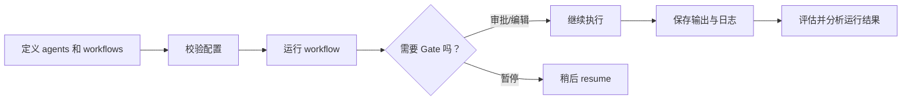
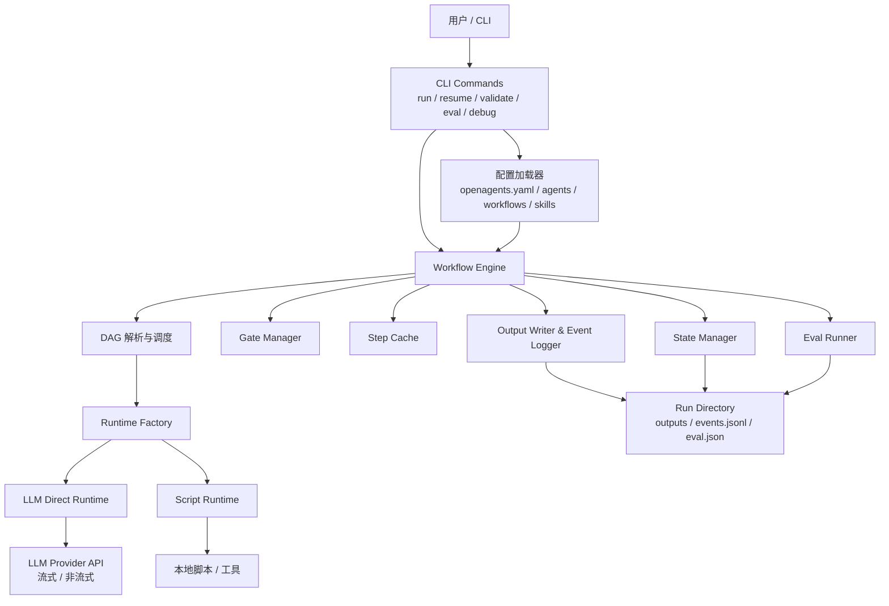

# OpenAgents（中文文档）

面向终端的透明、可控、多 Agent 工作流编排引擎。

[English README](./README.md)

## 为什么是 OpenAgents

OpenAgents 适合那些“让 Agent 跑起来”还不够的场景。
你可以实时观察执行进度，在关键节点人工审核，中断后继续恢复，并把输出、日志、状态、评估结果都完整落盘。

### 核心原则

- **看得见**：执行进度逐步可视化
- **管得住**：关键步骤可审核、可编辑、可恢复
- **查得到**：输出、日志、运行状态、评估结果都可追溯

## 核心亮点

### 工作流执行

- 基于 DAG 的多 Agent 编排与并行调度
- 人工门控，支持 `yes` / `no` / `edit`
- Gate 自动化控制：`--auto-approve`、`--gate-timeout`
- 基于状态文件恢复中断运行
- 同时支持流式与非流式 LLM 输出
- LLM Function Calling 多轮工具调用
- Script Runtime 支持本地脚本预处理或自定义执行
- Step Post-Processors 支持输出精简和变换
- Step / Workflow 级缓存支持重复运行优化
- 错误恢复模式：`fail`、`skip`、`fallback`、`notify`

### 提示词与上下文

- 支持纯文本输入，以及 `--input-json`、`--input-file` 结构化输入
- 支持 `{{input}}`、`{{inputs.xxx}}`、`{{context.stepId}}` 等模板变量
- 上下文处理策略：`raw`、`truncate`、`summarize`、`auto`
- Skills 注册表支持可复用指令

### 开发者体验

- 基于 `ora`、`chalk`、`boxen` 的终端进度 UI
- 配置校验支持 schema 与高级规则检查
- `openagents debug template` 模板预览
- `openagents dag` 工作流 DAG 可视化
- `openagents debug server` 调试 HTTP 服务
- 运行状态、日志、评估结果一键查看
- 内置工作流评估与趋势分析

### Provider 兼容性

- 基于 OpenAI-compatible 风格的 `llm-direct` runtime
- 自动兼容把推理结果放在 `reasoning_content` 的 provider
- 自动兼容“请求流式但返回普通 JSON”的 provider

## 快速开始

### 1. 安装依赖

```bash
npm install
npm run build
```

### 2. 直接从源码运行

```bash
npx tsx src/cli/index.ts run novel_writing --input "一个时间旅行悬疑故事"
```

### 3. 或初始化一个示例项目

```bash
npx tsx src/cli/index.ts init my-project
cd my-project
export OPENAGENTS_API_KEY=sk-xxxx
npx tsx src/cli/index.ts run novel_writing --input "一个时间旅行悬疑故事"
```

## 初始化模板

目前 `init` 命令内置这些模板：

| 模板 | 用途 |
| --- | --- |
| `default` | 通用项目模板 |
| `chatbot` | 对话式 Agent 工作流 |
| `web-scraper` | 网页提取与摘要工作流 |

查看模板列表：

```bash
openagents init --list-templates
```

使用指定模板：

```bash
openagents init my-project --template chatbot
```

## 常用命令

### 初始化与校验

```bash
openagents init [directory]
openagents init [directory] --template <name>
openagents init --list-templates
openagents validate
openagents validate --verbose
```

### 运行工作流

```bash
openagents run <workflow_id> --input "..."
openagents run <workflow_id> --input-json '{"topic":"climate"}'
openagents run <workflow_id> --input-file ./input.json
openagents run <workflow_id> --stream
openagents run <workflow_id> --auto-approve
openagents run <workflow_id> --gate-timeout 30
openagents run <workflow_id> --no-eval
openagents resume <run_id>
openagents resume <run_id> --stream
```

### 查看运行结果

```bash
openagents runs list
openagents runs list --workflow <workflow_id>
openagents runs list --eval
openagents runs show <run_id>
openagents runs logs <run_id>
openagents eval <run_id>
openagents analyze <workflow_id>
```

### 浏览项目能力

```bash
openagents agents list
openagents agents list --skills
openagents workflows list
openagents dag <workflow_id>
openagents debug template <workflow_id> --input-json '{"key":"value"}'
openagents debug server
openagents cache stats
openagents cache clear
```

## 典型工作流



## 架构图



整体上可以理解为：CLI 负责接收用户命令并加载项目配置，Workflow Engine 生成执行计划并驱动各步骤运行，Runtime 负责实际执行，而输出、日志、状态、评估结果都会统一写入运行目录，便于回放、排查和分析。

## 配置示例

### 结构化输入

```yaml
steps:
  - id: plan
    agent: planner
    task: "为 {{inputs.topic}} 生成一份 {{inputs.language}} 计划。"
```

运行方式：

```bash
openagents run report --input-json '{"topic":"AI 安全","language":"中文"}'
```

### 上下文处理

```yaml
steps:
  - id: research
    agent: researcher
    task: "收集背景信息"

  - id: write
    agent: writer
    depends_on: [research]
    context:
      from: research
      strategy: auto
      max_tokens: 1000
      inject_as: system
    task: "基于以下内容写作：{{context.research}}"
```

### 错误恢复

```yaml
steps:
  - id: summarize
    agent: writer
    on_failure: fallback
    fallback_agent: backup_writer
    task: "总结研究结果"
```

支持的 `on_failure`：

- `fail`：停止工作流
- `skip`：跳过当前步骤，尽可能继续执行后续步骤
- `fallback`：切换到 `fallback_agent`
- `notify`：发送 `notify.webhook` 后失败退出

### 步骤后置处理器

```yaml
steps:
  - id: load_context
    agent: planner
    task: "生成较长上下文"
    post_processors:
      - type: script
        name: shrink_context
        command: node scripts/shrink-context.mjs
        timeout_ms: 5000
        max_output_chars: 20000
        on_error: fail
```

脚本处理器约定：

- 输入来自 `stdin`
- 输出写入 `stdout`
- 日志写入 `stderr`
- 退出码 `0` 表示成功
- 可用环境变量：`OA_RUN_ID`、`OA_WORKFLOW_ID`、`OA_STEP_ID`、`OA_PROCESSOR_NAME`

## 评估与分析

OpenAgents 可以在运行完成后使用 LLM Judge 做评估，并和历史运行结果做对比。

```yaml
workflow:
  eval:
    enabled: true
    type: llm-judge
    judge_model: qwen-plus
    dimensions:
      - name: quality
        weight: 1.0
        prompt: "评估输出整体质量"
```

常用命令：

```bash
openagents eval <run_id>
openagents runs list --eval
openagents analyze <workflow_id>
```

## Skills 注册表

在 `skills/` 目录下定义可复用技能：

```yaml
skill:
  id: math
  name: 数学助手
  description: 执行数学计算
  version: 1.0

instructions: |
  你是一个数学助手。请精确计算并展示推导过程。

output_format: 返回 JSON，包含 "result" 和 "steps" 字段。
```

在模板中引用：

```text
{{skills.math.instructions}}
```

## 项目结构

```text
src/
  cli/        CLI 子命令
  config/     YAML 加载与校验
  engine/     调度、执行、缓存、状态管理
  runtime/    llm-direct 与 script runtime
  output/     输出文件、日志、通知
  eval/       评估执行与 Judge 逻辑
  ui/         终端界面渲染
templates/    项目初始化模板
docs/         设计文档、路线图、进度记录
```

## 多语言支持

- 支持语言：`en`、`zh`
- 默认语言：`en`
- 优先级：`--lang` > `OPENAGENTS_LANG` > 默认 `en`

示例：

```bash
npx tsx src/cli/index.ts --lang zh run novel_writing --input "悬疑故事"
OPENAGENTS_LANG=zh npx tsx src/cli/index.ts run novel_writing --input "悬疑故事"
```

## 相关文档

- [English README](./README.md)
- [技术设计](./docs/TECHNICAL-DESIGN.md)
- [开发进度](./docs/PROGRESS.md)
- [功能路线图](./docs/FEATURE-ROADMAP.md)

## 许可证

MIT
